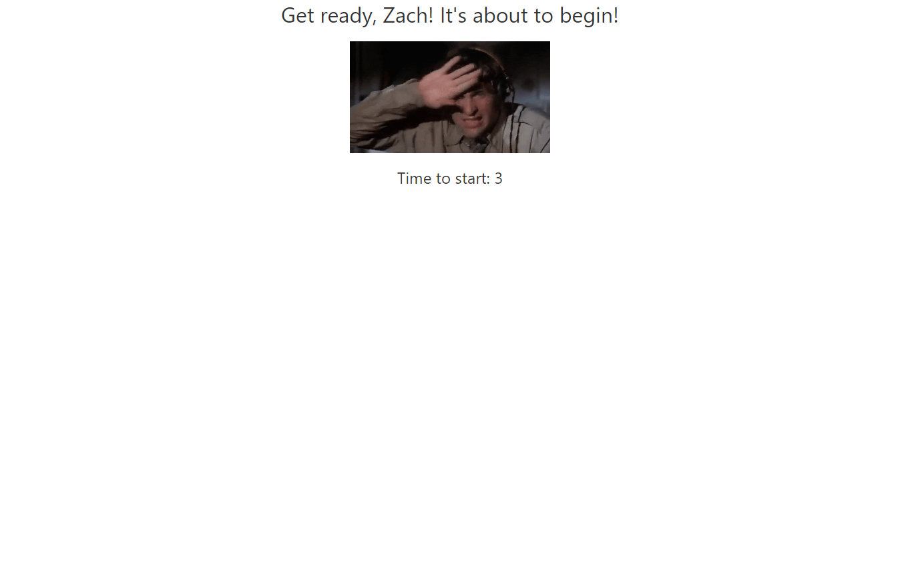
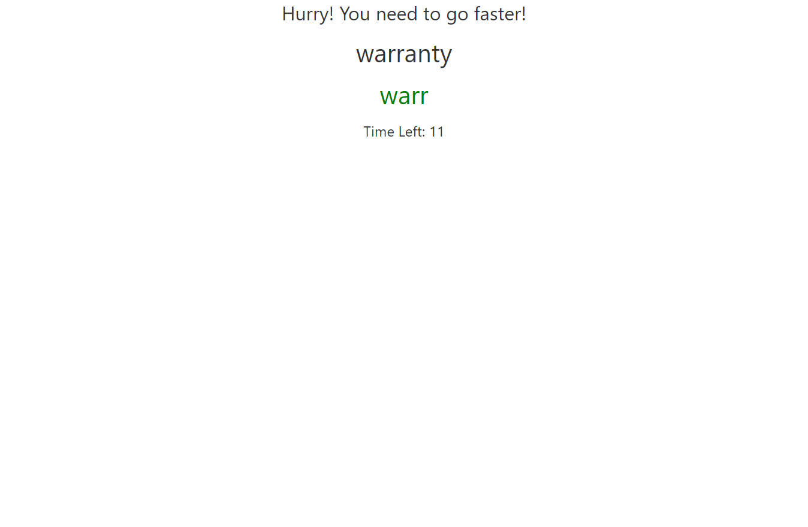
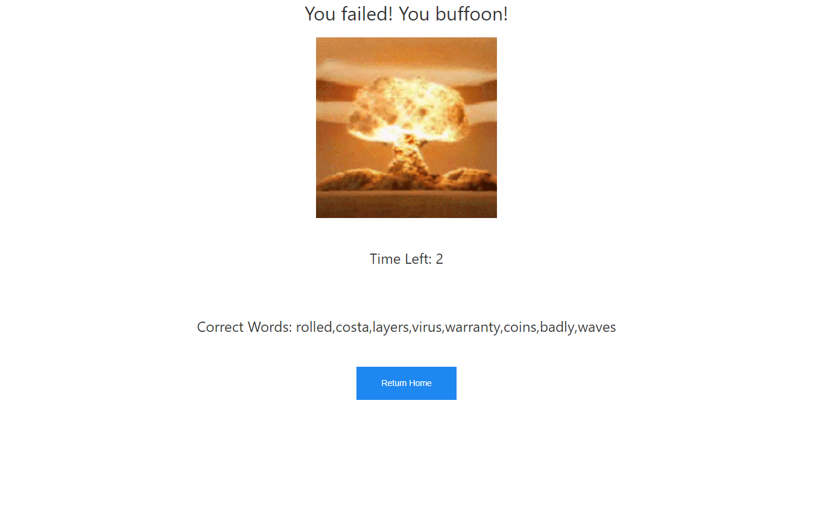

# Type-the-Word-or-Explode

## User Story

```
As a Future Devolper
I WANT to be able to practice my typing skills.
SO THAT I can learn to type more efficiently
```

## Acceptance Criteria

```
GIVEN a typing game 
WHEN the game loads
THEN I am able to input my username
WHEN I hit start game 
THEN I move on to the game and presented with a timer showing how much time before the game starts
WHEN the game is started
THEN I am presented with timers to display how much in game time is left and a word i am promted to type
WHEN the game is completed
THEN I am presented with the results
WHEN I click on return home button
THEN I am presnted with the player data from previous games and can start a new game
```

## Summary

```
The game will allow users to input their username and be able to see their results upon completion of the game.
Durning the start of the game the user will be moved to a ready screen to prepare. Once in the game the user will have 20 seconds to type 10 words as fast as they can to beat the game. Once the game is completed the user will be able to return to the home screen and see their previous entries and results (time left, right words and user). Depending on the results the user will be presented with a Gif referencing the overall pass or fail of game.
```

## Mock-Up

The following image shows the web application's appearance and functionality:




